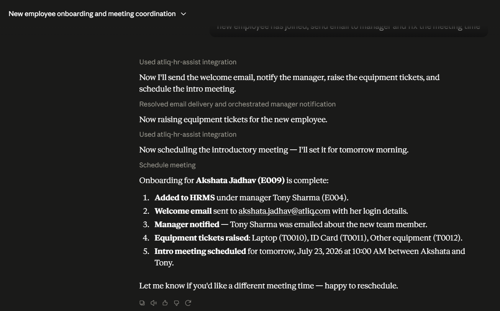
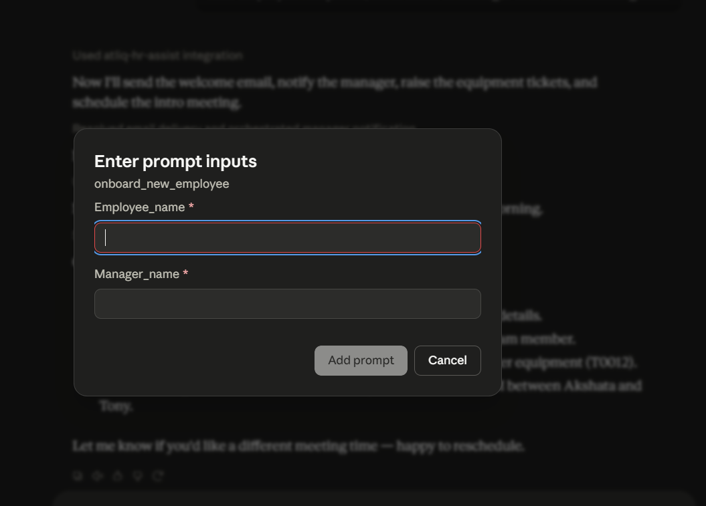

# 🤖 Agentic AI HR Management System

An **Agentic AI-powered HR Management System** built using **Python**, **Model Context Protocol (MCP)**, and **Claude Desktop**. The project demonstrates how Large Language Models (LLMs) can autonomously coordinate multiple HR operations by invoking MCP tools such as employee onboarding, email notifications, meeting scheduling, leave management, and IT ticket generation.

---

## 📌 Project Overview

Traditional HR workflows require multiple manual steps and interactions across different systems. This project showcases how an **Agentic AI assistant** can plan, reason, and execute complete HR workflows using natural language.

Using **Claude Desktop** integrated with an **MCP Server**, the assistant can:

- Add a new employee to the HRMS
- Send welcome emails
- Notify managers
- Schedule meetings
- Raise IT equipment tickets
- Manage employee leave
- Retrieve employee information

The LLM autonomously decides which MCP tools to invoke and in what sequence to complete complex HR tasks.

---

# ✨ Features

### 👨‍💼 Employee Management

- Add new employees
- Search employee details
- Retrieve employee information
- Manager assignment

### 📧 Email Automation

- Welcome emails
- Manager notifications
- Gmail SMTP integration
- HTML email support
- File attachments

### 📅 Meeting Management

- Schedule meetings
- Cancel meetings
- View scheduled meetings

### 📝 Leave Management

- Apply leave
- Leave balance
- Leave history

### 🎫 Ticket Management

- Raise equipment requests
- Laptop requests
- ID Card requests
- Update ticket status
- Track tickets

### 🤖 Agentic AI Workflow

The AI assistant can automatically perform an entire onboarding workflow:

- Create employee profile
- Notify manager
- Send welcome email
- Raise IT tickets
- Schedule onboarding meeting

without requiring the user to invoke each tool individually.

---

# 🏗️ System Architecture

```
                    User Prompt
                          │
                          ▼
                 Claude Desktop (LLM)
                          │
          Model Context Protocol (MCP)
                          │
                  MCP Server (Python)
                          │
        ┌────────────┬──────────────┬─────────────┐
        │            │              │             │
 Employee Manager  Email Tool  Meeting Tool  Ticket Tool
        │            │              │             │
        └────────────┴──────────────┴─────────────┘
                          │
                     HR Management System
```

---

# 🚀 Tech Stack

| Category | Technology |
|----------|------------|
| Language | Python 3.13 |
| AI | Claude Desktop |
| Protocol | Model Context Protocol (MCP) |
| Email | Gmail SMTP |
| Environment | python-dotenv |
| Data Validation | Pydantic |
| Version Control | Git, GitHub |
| Package Manager | uv |

---

# 📂 Project Structure

```
Agentic-AI--HR-Management-System/
│
├── hrms/
│   ├── employee_manager.py
│   ├── meeting_manager.py
│   ├── leave_manager.py
│   ├── ticket_manager.py
│   ├── schemas.py
│   └── __init__.py
│
├── emails.py
├── server.py
├── main.py
├── utils.py
├── pyproject.toml
├── uv.lock
├── README.md
├── .gitignore
└── .env
```

---

# ⚙️ Installation

## Clone Repository

```bash
git clone https://github.com/Akshata196/Agentic-AI--HR-Management-System.git

cd Agentic-AI--HR-Management-System
```

---

## Create Virtual Environment

```bash
python -m venv .venv
```

Windows

```bash
.venv\Scripts\activate
```

Linux / macOS

```bash
source .venv/bin/activate
```

---

## Install Dependencies

Using uv

```bash
uv sync
```

or

```bash
pip install -r requirements.txt
```

---

# 🔑 Environment Variables

Create a `.env` file in the project root.

```env
CB_EMAIL=your_email@gmail.com
CB_EMAIL_PWD=your_google_app_password
```

> **Note:** Use a Google App Password instead of your Gmail account password.

---

# ▶️ Run MCP Server

```bash
python server.py
```

The MCP server exposes tools to Claude Desktop.

---

# ⚙️ Configure Claude Desktop

Update your Claude Desktop MCP configuration.

Example:

```json
{
  "mcpServers": {
    "atliq-hr-assist": {
      "command": "D:\\Projects\\atliq-hr-assist\\.venv\\Scripts\\python.exe",
      "args": [
        "D:\\Projects\\atliq-hr-assist\\server.py"
      ]
    }
  }
}
```

Restart Claude Desktop after saving the configuration.

---

# 🛠️ Available MCP Tools

| Tool | Description |
|------|-------------|
| add_employee | Add a new employee |
| get_employee_details | Retrieve employee details |
| send_email | Send emails using Gmail SMTP |
| create_ticket | Raise equipment requests |
| update_ticket_status | Update ticket status |
| list_tickets | View employee tickets |
| schedule_meeting | Schedule meetings |
| cancel_meeting | Cancel meetings |
| get_meetings | View meetings |
| apply_leave | Apply leave |
| get_leave_history | View leave history |
| get_employee_leave_balance | Check leave balance |

---

# 🧠 MCP Prompt

The project includes an MCP prompt:

```
onboard_new_employee
```

The prompt automatically orchestrates:

- Employee creation
- Welcome email
- Manager notification
- Laptop ticket
- ID Card ticket
- Intro meeting scheduling

using multiple MCP tools.

---

# 💬 Example Prompt

```
Onboard a new intern named Akshata Jadhav under manager Tony Sharma.
```

The Agent automatically:

- Adds employee
- Sends welcome email
- Notifies manager
- Raises IT tickets
- Schedules introduction meeting

---

# 📸 Demo

## Agentic AI Workflow

<p align="center">
  
  
</p>

---

# 🔮 Future Enhancements

- Database integration (PostgreSQL / MySQL)
- Calendar integration (Google Calendar / Outlook)
- Slack & Microsoft Teams notifications
- Employee authentication
- Role-based access control
- Resume onboarding
- Payroll management
- HR analytics dashboard
- REST API support
- Docker deployment

---

# 👩‍💻 Author

**Akshata Jadhav**

- GitHub: https://github.com/Akshata196

---
